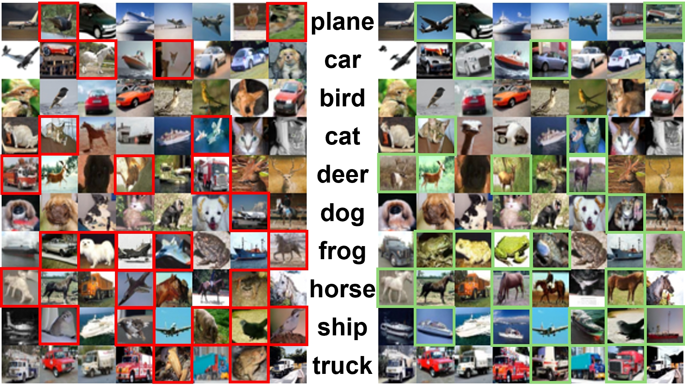

## Guiding Noisy Label Conditional Diffusion Models with Score-based Discriminator Correction<br><sub>Official PyTorch implementation</sub>



** Guiding Noisy Label Conditional Diffusion Models with Score-based Discriminator Correction**<br>
Dat Nguyen Cong, Hieu Tran Bao, Thanh Tung-Hoang

Abstract: *Diffusion models have gained prominence as state-of-the-art techniques for synthesizing images and videos, particularly due to their ability to scale effectively with large datasets. Recent studies have uncovered that these extensive datasets often contain mistakes from manual labeling processes. However, the extent to which such errors compromise the generative capabilities and controllability of diffusion models is not well studied. This paper introduces Score-based Discriminator Correction (SBDC), a guidance technique for aligning noisy pre-trained conditional diffusion models. The guidance is built on discriminator training using adversarial loss, drawing on prior noise detection techniques to assess the authenticity of each sample. We further show that limiting the usage of our guidance to the early phase of the generation process leads to better performance. Our method is computationally efficient, only marginally increases inference time, and does not require retraining diffusion models. Experiments on different noise settings demonstrate the superiority of our method over previous state-of-the-art methods*

## Requirements

* Linux and Windows are supported, but we recommend Linux for performance and compatibility reasons.
* 1+ high-end NVIDIA GPU for sampling and training. We have done all testing and development using A100 GPUs.
* 64-bit Python 3.9 and PyTorch 2.x. See https://pytorch.org for PyTorch install instructions.
* Python libraries: See [environment.yml](./environment.yml) for exact library dependencies. You can use the following commands with Miniconda3 to create and activate your Python environment:
  - `conda env create -f environment.yml -n edm`
  - `conda activate edm`


## Pre-trained models

To generate a batch of images using a given model and sampler, run:

```.bash
# Generate 64 images and save them as out/*.png
python generate.py --outdir=out --seeds=0-63 --batch=64 \
    --network=https://nvlabs-fi-cdn.nvidia.com/edm/pretrained/edm-cifar10-32x32-cond-vp.pkl
```

Generating a large number of images can be time-consuming; the workload can be distributed across multiple GPUs by launching the above command using `torchrun`:

```.bash
# Generate 1024 images using 2 GPUs
torchrun --standalone --nproc_per_node=2 generate.py --outdir=out --seeds=0-999 --batch=64 \
    --network=https://nvlabs-fi-cdn.nvidia.com/edm/pretrained/edm-cifar10-32x32-cond-vp.pkl
```

The sampler settings can be controlled through command-line options; see [`python generate.py --help`](./docs/generate-help.txt) for more information. For best results, we recommend using the following settings for each dataset:

```.bash
# For CIFAR-10 at 32x32, use deterministic sampling with 18 steps (NFE = 35)
python generate.py --outdir=out --steps=18 \
    --network=https://nvlabs-fi-cdn.nvidia.com/edm/pretrained/edm-cifar10-32x32-cond-vp.pkl

```

Generating a large number of images for EDM with SBDC:

```.bash
# Generate 1024 images using 2 GPUs with SBDC
torchrun --standalone --nproc_per_node=2 generate.py --outdir=out --seeds=0-999 --batch=64 \
    --network=https://nvlabs-fi-cdn.nvidia.com/edm/pretrained/edm-cifar10-32x32-cond-vp.pkl \
    --discriminator=</path/to/discriminator/pkl> --S_clip_min 1.5 --S_clip_max 50 \
    --dg_weight_1st_order 0.9 --dg_weight_2nd_order 0.9
```
We provide several discriminator checkpoints for different noise settings here: [Google Drive](https://drive.google.com/drive/folders/1WCrsHzNvDr7LF7h2WJV2lT1HzQvK6wnj?usp=sharing)

## Calculating FID

To compute Fr&eacute;chet inception distance (FID) for a given model and sampler, first generate 50,000 random images and then compare them against the dataset reference statistics using `fid.py`:

```.bash
# Generate 50000 images and save them as fid-tmp/*/*.png
torchrun --standalone --nproc_per_node=1 generate.py --outdir=fid-tmp --seeds=0-49999 --subdirs \
    --network=https://nvlabs-fi-cdn.nvidia.com/edm/pretrained/edm-cifar10-32x32-cond-vp.pkl

# Calculate FID
cd evaluation_utils
python evaluator_fmiprdc.py <ref/image/path> <sample/image/path>
```

The second command typically takes 1-3 minutes in practice, but the first one can sometimes take several hours, depending on the configuration. See [`README.md`](./evaluation_utils/README.md) for the full list of options.


## Preparing datasets
Prepare datasets and set the path to the data with `--data`. We provide several noisy datasets that we use in our experiments below. We created the synthetic data (`cifar10`,`cifar100`) following [CORES](https://github.com/haochenglouis/cores). 

Using noise detection method, we obtain the real/fake label of each sample in the noisy dataset. The label is saved as `npz` format and is load as shown in file `training/dataset.py`. Set the path to the real/fake label with `--label-path`. We also provide some detection checkpoints below.

Noisy Label Detection: [Google Drive](https://drive.google.com/drive/folders/1WCrsHzNvDr7LF7h2WJV2lT1HzQvK6wnj?usp=sharing)

Datasets are stored in various formats (`pickle`,`npz`,`folder`): all images are saved in a numpy array, along with their label array. Custom datasets can be created from a folder containing images.


## Training new discriminator models

You can train new models using `train_discriminator.py`. For example:

```.bash
# Train DDPM++ model for class-conditional CIFAR-10 using 1 GPUs
torchrun --standalone --nproc_per_node=1 train_discriminator.py --outdir=discriminator-runs \
    --data=datasets/cifar10_sym_40-32x32.zip --label-path </path/to/real-fake-label> \
    --cond=1 --arch=ddpmpp --batch 1024 --simix 1
```

The training always use random shuffle as proposed in our method to stabilize the training process. You can set `--simix` to either 0/1 for faster training. The above example uses the default batch size of 512 images (controlled by `--batch`) . Training discriminator is efficient since models are relatively small; you can either limit the per-GPU batch size, e.g., `--batch-gpu=32`. This employs gradient accumulation to yield the same results as using full per-GPU batches. See [`python train_discriminator.py --help`](./docs/train-help.txt) for the full list of options.

The results of each training run are saved to a newly created directory, for example `discriminator-runs/00000-cifar10-cond-ddpmpp-edm-gpus1-batch512-fp32`. The training loop exports network snapshots (`network-snapshot-*.pkl`) and training states (`training-state-*.pt`) at regular intervals (controlled by `--snap` and `--dump`). The network snapshots can be used to generate images with `generate.py`, and the training states can be used to resume the training later on (`--resume`). Other useful information is recorded in `log.txt` and `stats.jsonl`. We also support logging to wandb (`--wandb-api-key`). To monitor training convergence, we recommend looking at the training loss (`"Loss/loss"` in `stats.jsonl` or `"Correction rate"` in `wandb`) as well as periodically evaluating FID for `network-snapshot-*.pkl` using `generate.py` and `evaluate_fmiprdc.py`.

All training and inference are conducted on 1 NVIDIA DGX A100 nodes, each containing 8 Ampere GPUs with 40 GB of memory. To reduce the GPU memory requirements, we recommend either training the model with more GPUs or limiting the per-GPU batch size with `--batch-gpu`. To set up multi-node training, please consult the [torchrun documentation](https://pytorch.org/docs/stable/elastic/run.html).

## License

Copyright &copy; 2022, NVIDIA CORPORATION & AFFILIATES. All rights reserved.

All material, including source code and pre-trained models, is licensed under the [Creative Commons Attribution-NonCommercial-ShareAlike 4.0 International License](http://creativecommons.org/licenses/by-nc-sa/4.0/).

## Acknowledgements

This work is heavily built upon the code from:
* [Karras, T., Aittala, M., Aila, T., & Laine, S. (2022). Elucidating the design space of diffusion-based generative models. *Advances in Neural Information Processing Systems, 35, 26565-26577*.](https://github.com/NVlabs/edm)

## Citation

```
@inproceedings{Karras2022edm,
  author    = {Tero Karras and Miika Aittala and Timo Aila and Samuli Laine},
  title     = {Elucidating the Design Space of Diffusion-Based Generative Models},
  booktitle = {Proc. NeurIPS},
  year      = {2022}
}
```

## Development

This is a research reference implementation and is treated as a one-time code drop. As such, we do not accept outside code contributions in the form of pull requests.

